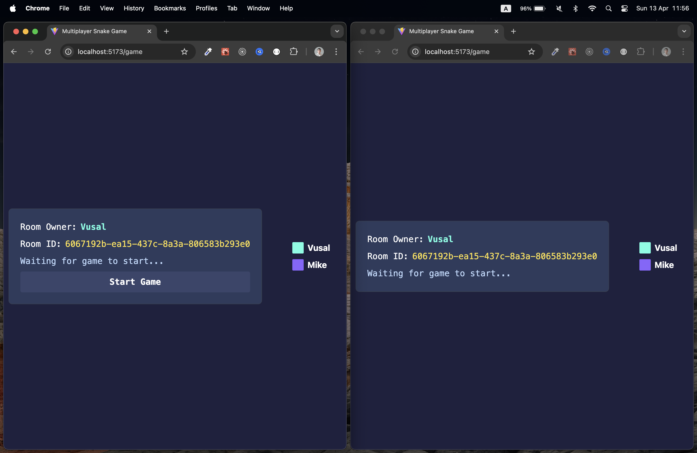
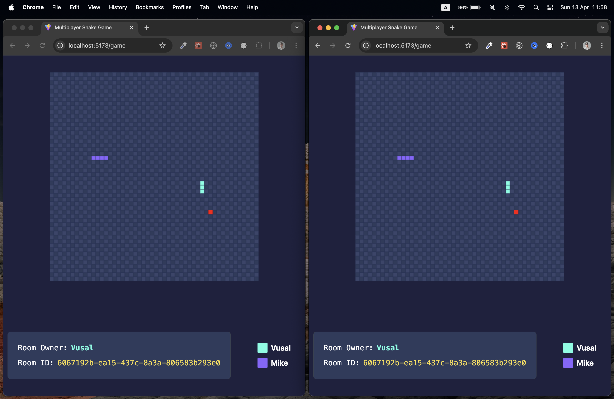

# Multiplayer Snake Game 🎮🐍

Welcome to the **Multiplayer Snake Game**, a modern twist on the classic snake game where you can compete with friends in real-time! This project is built using **NestJS** for the server and **React** with **Vite** for the client, ensuring a fast and scalable gaming experience.

---

## Features ✨

- **Multiplayer Gameplay**: Join or create rooms to play with friends. 👫
- **Dynamic Game Board**: Real-time updates of the game state. 🕹️
- **Customizable Player Colors**: Each player gets a unique color. 🎨
- **Responsive Design**: Play on any device with a modern browser. 📱💻

---

## Screenshots 📸

### Game Room



### In-Game



---

## Getting Started 🚀

### Prerequisites ✅

- **Node.js** (v16 or later)
- **npm** (v7 or later)

### Installation 🛠️

1. Clone the repository:

   ```bash
   git clone https://github.com/your-username/multiplayer-snake-game.git
   cd multiplayer-snake-game
   ```

2. Install dependencies for both the server and client:
   ```bash
   cd server && npm install
   cd ../client && npm install
   ```

### Running the Application ▶️

#### Server 🖥️

1. Navigate to the `server` directory:

   ```bash
   cd server
   ```

2. Start the server in development mode:
   ```bash
   npm run start:dev
   ```

#### Client 🌐

1. Navigate to the `client` directory:

   ```bash
   cd client
   ```

2. Start the client in development mode:

   ```bash
   npm run dev
   ```

3. Open your browser and navigate to `http://localhost:5173`.

---

## How to Play 🎮

1. **Create or Join a Room**: Enter your name and either create a new room or join an existing one. 🏠
2. **Start the Game**: The room owner can start the game once all players are ready. 🟢
3. **Control Your Snake**: Use the arrow keys to move your snake and collect food to grow. ⬆️⬇️⬅️➡️
4. **Avoid Collisions**: Stay alive by avoiding walls and other players' snakes. 🚧

---

## Project Structure 🗂️

```
multiplayer-snake-game/
├── client/       # Frontend code (React + Vite)
├── server/       # Backend code (NestJS)
└── assets/       # Images and other assets
```

---

## Contributing 🤝

Contributions are welcome! Feel free to open an issue or submit a pull request. 🛠️

---

## License 📜

This project is licensed under the MIT License. See the [LICENSE](LICENSE) file for details.

---

## Acknowledgments 🙌

- **NestJS**: For the robust backend framework. 🛡️
- **React**: For the dynamic and responsive frontend. ⚛️
- **Socket.IO**: For real-time communication. 🔌
- **Vite**: For the fast development experience. ⚡
